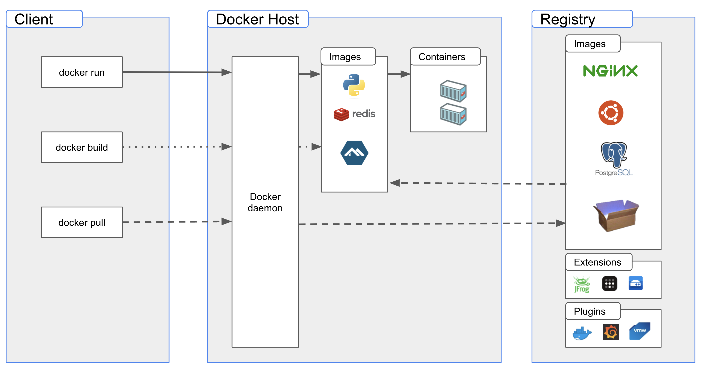

# Docker

## 什麼是 Docker?

`Docker` 是一個開源的輕量級容器化平台，將應用程式及其相依性資源打包到容器 (`Container`) 中，讓應用程式可以在不同環境下執行，容器間相互隔離。容器可以簡化應用程式的開發、部署和運維，具備高可攜性和容易擴展特性。

## Docker 有哪些管理資源和相關檔案組成？

`Registy`: 儲存並下載映像檔的託管平台

資源：
    `Image`: 映像檔，啟動容器的範本
    `Container`: 容器，服務或應用程式的實例
    `Volumn`: 資料卷，持久化的資料儲存空間
    `Network`: 網路設定，配置不同容器的網路連接方式

相關檔案：
    `Dockerfile`: 記錄應用程式安裝、配置和執行環境等相依性資源的腳本定義

相關工具：
    `Docker Compose`: 定義和運行多個容器的管理工具
    `docker-compose.yml`: 配置檔
    `Docker Swarm`: 提供原生容器叢集功能

## 什麼是 Docker Engine ?

`Docker Engine` 是一個開源容器化技術，用來建置和容器化應用程式。 `Docker Engine` 是一個 `server-client` 的服務，主要由有一個長時間在背景執行的服務 `dockerd`，透過 `docker cli` 和 `API` 來溝通管理，這三個部分組成。

## Pros & Cons

- 啟動速度快、檔案佔用小
- 統一開發、測試、正式環境
- Dockerfile 記錄應用程式和環境配置，搭配版本控管，達成作業標準化和基礎架構程式化 (`Infrastructure as Code`)
- 高可攜性、高擴展性、高維護性
- 容器彼此間相互隔離
- 共用 `OS kernal` 和硬體資源，容器間容易相互影響執行
- `Linux container` 只能跑在 `Linux`, `macOS`，`Windows container` 只能跑在 `Windows` 上
- 作業系統等級的隔離程度，`Host` 能看到和管理容器中的執行程式，可能會有資安風險

## 適用場景

- 微服務 (`Microservice`)
- `DevOps`、`CI/CD`
- 快速建立開發環境

## 延伸資源

- [moby/moby](https://github.com/moby/moby)
- [10 個 Q&A 快速認識 Docker | iThome](https://www.ithome.com.tw/news/91847)
- [cgroups](https://en.wikipedia.org/wiki/Cgroups)
- [Linux namespaces](https://en.wikipedia.org/wiki/Linux_namespaces)

## 參考資源

- [Docker Engine overview | Docker Documentation](https://docs.docker.com/engine/)
- [Docker overview | Docker Documentation](https://docs.docker.com/get-started/overview/)
