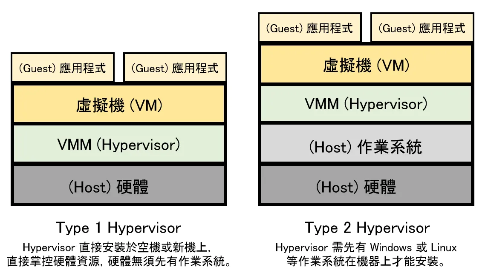

# Virtual Machine (VM)

## 什麼是 Virtual Machine?

`Virtual Machine` 虛擬機器，透過 `hypervisor` 把實體硬體虛擬化，模擬 `CPU`, `RAM`, `Disk` 等資源，建立出虛擬機器。
可在上面安裝和執行作業系統、應用程式等等。感覺和一般真實電腦執行一樣，唯一不同就是虛擬機器的硬體資源是虛擬的。

## Virtul Machine 的主要構成檔案？

主要構成檔案有日誌記錄檔、`NVRAM` 設定檔、虛擬磁碟檔，以及組態設定檔。
完整檔案分類如以下列表

- `.vmx`: 虛擬機器組態檔
- `.vmxf`: 其他虛擬機器組態檔
- `.vmdk`: 虛擬磁碟特性
- `-flat.vmdk`: 虛擬機器資料磁碟
- `.nvram`: 虛擬機器 `BIOS` 或 `EFI` 組態
- `.vmem`: 虛擬機器分頁備份檔案
- `.vmsd`: 虛擬機器快照
- `.vmsn`: 虛擬機器快照資料檔案
- `.vswp`: 虛擬機器分頁檔
- `.vmss`: 虛擬機器暫停檔案
- `.log`: 目前虛擬機器記錄檔
- `-#.log`: 舊的虛擬機器記錄檔 (`#` 表示從 `1` 開始的編號)

## 什麼是 Hypervisor?

`Hypervisor` 虛擬化管理程式又稱為虛擬機監控程式 (`Virtual Machine Monitor`, `VMM`)，用來建立與執行 `VM`。可讓單一主機電腦透過虛擬化方式分享硬體資源，以建立多個 guest `VM`。

### Hypervisor 分為兩種類型

1. `Type1` (`bare metal`): 一種輕量化的作業系統，直接在主機硬體上執行
2. `Type2` (`hosted`): 以軟體的形式在 `OS` 上執行

> Type1 通常比 Type2 的效能更好，多數企業的熱門選擇

## Pros & Cons

- 硬體層級的隔離，安全性高
- 彼此獨立，且獨立於主機
- 比實體機器來的容易管理與維護
- 可在單一實體電腦上執行多個 VM，節省物理資源，時間和管理成本
- 提供災難復原與應用程式佈建選項
  - 快照與回滾
- 虛擬機的執行效率與速度會低於實體電腦
- 在單一實體電腦上執行多個虛擬機，可能會造成效能不穩定
- 高移植性、高隔離性、高可攜性

## 適用場景

- 沙箱：在隔離的環境中執行程式或測試
- 分散在不同實體主機上的服務，整合到同一個伺服器上使用 VM 管理
- 虛擬化服務器
- 雲計算

## 延伸資源

- [實現雲端運算的關鍵基礎：虛擬機 (Virtual Machine) - 寫點科普 Kopuchat](https://kopu.chat/%e9%9b%b2%e7%ab%af%e9%81%8b%e7%ae%97%e7%9a%84%e9%97%9c%e9%8d%b5%e5%9f%ba%e7%a4%8e%ef%bc%9a%e8%99%9b%e6%93%ac%e6%a9%9f/)

## 參考資源

- [What is a Virtual Machine? | VMware Glossary](https://www.vmware.com/topics/glossary/content/virtual-machine.html)
- [What is a Hypervisor? | VMware Glossary](https://www.vmware.com/content/vmware/vmware-published-sites/us/topics/glossary/content/hypervisor.html.html)
